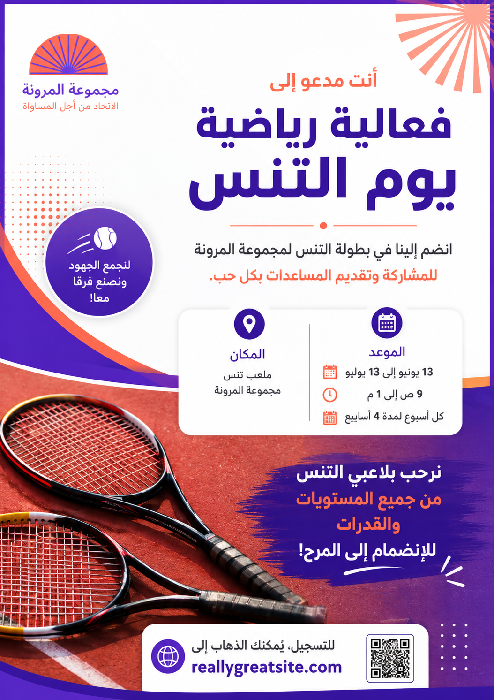

# 🎨 تحسين محتوى صورة باستخدام ChatGPT

## 🏆 ChatGPT Image Enhancement Task

**تطبيق عملي على Poster لفعالية رياضية — يوم التنس**

> الهدف: استخدام ChatGPT لتحليل صورة، استخراج محتواها، تحسين الصياغة، تنظيم المعلومات، واقتراح تحسينات تجعل التصميم أكثر وضوحًا واحترافية.

---

## 🎯 المطلوب في التاسك

- تحليل محتوى الصورة.
- استخراج النص الموجود بها.
- تحسين النص لغويًا وتسويقيًا.
- تنظيم المعلومات الأساسية.
- اقتراح تحسينات على التصميم والترتيب البصري.
- عرض النتيجة قبل وبعد.

---

## 🧠 الـPrompt المستخدم

```text
حلل الصورة المرفقة باعتبارها Poster إعلاني لفعالية رياضية. استخرج النص الموجود بها، ثم حسّن المحتوى من الناحية اللغوية والتسويقية، وصحح أي أخطاء، واجعل النص أكثر احترافية ووضوحًا وجاذبية، مع الحفاظ على نفس فكرة الإعلان ومعلوماته الأساسية. اقترح أيضًا تحسينات على ترتيب النصوص والعناوين داخل التصميم. اعرض النص الأصلي، ثم النص المحسن، ثم اذكر أهم التحسينات التي أجريتها.
```

---

## 📝 النص الأصلي

- مجموعة المرونة — الاتحاد من أجل المساواة.
- أنت مدعو إلى فعالية رياضية: يوم التنس.
- انضم إلينا في بطولة التنس لجمع الأموال لمجموعة المرونة لتقديم المساعدات بكل حب.
- الميعاد: 13 يونيو إلى 13 يوليو، من 9 ص إلى 1 م، كل أسبوع لمدة 4 أسابيع.
- المكان: ملعب تنس بمجموعة المرونة.
- نرحب بلاعبي التنس من جميع المستويات والقدرات للانضمام إلى المرح.
- للتسجيل: reallygreatsite.com

---

## ✨ النص المحسّن

### أنت مدعو إلى
# فعالية رياضية — يوم التنس

انضم إلينا في بطولة التنس لمجموعة المرونة **للمشاركة وتقديم المساعدات بكل حب.**

**الموعد**  
13 يونيو إلى 13 يوليو — من 9 ص إلى 1 م — كل أسبوع لمدة 4 أسابيع.

**المكان**  
ملعب تنس مجموعة المرونة.

**نرحب بلاعبي التنس من جميع المستويات والقدرات للانضمام إلى المرح!**

**التسجيل:** reallygreatsite.com

---

## 🚀 أهم التحسينات

1. إعادة صياغة العنوان ليكون أوضح وأكثر جذبًا.
2. تحسين الدعوة للمشاركة مع الحفاظ على فكرة الإعلان الأصلية.
3. فصل معلومات الموعد والمكان لتسهيل القراءة.
4. إبراز المعلومات الأساسية بدل وضعها داخل فقرات طويلة.
5. تحسين التسلسل البصري: العنوان ← الوصف ← الموعد والمكان ← الدعوة ← التسجيل.
6. اقتراح تصميم أكثر حداثة مع الحفاظ على الهوية اللونية الأساسية.
7. جعل رابط التسجيل أكثر وضوحًا.

---

## 🔄 Before / After

ضع هنا **الصورة الأصلية** و**النسخة المحسّنة** داخل مجلد `images/`، ثم أضفهما إلى الصفحة بهذه الصيغة:

```markdown



```

---

## 📂 هيكل المشروع المقترح

```text
chatgpt-image-enhancement-task/
├── README.md
├── index.html
└── images/
    ├── original-poster.png
    └── enhanced-poster.png
```

---

## 🤖 الخلاصة

تم استخدام ChatGPT كأداة لتحليل الصورة واستخراج محتواها وتحسين الصياغة والتنظيم، ثم تحويل الملاحظات إلى تصور أكثر احترافية للـPoster.

**النتيجة: توثيق كامل للتاسك من المدخلات → الـPrompt → التحليل → التحسين → النتيجة النهائية.**
