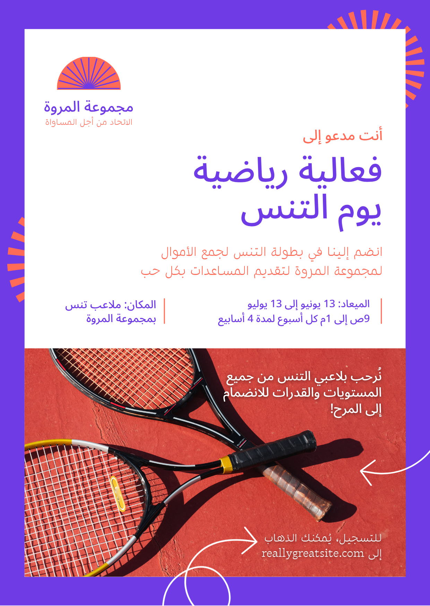
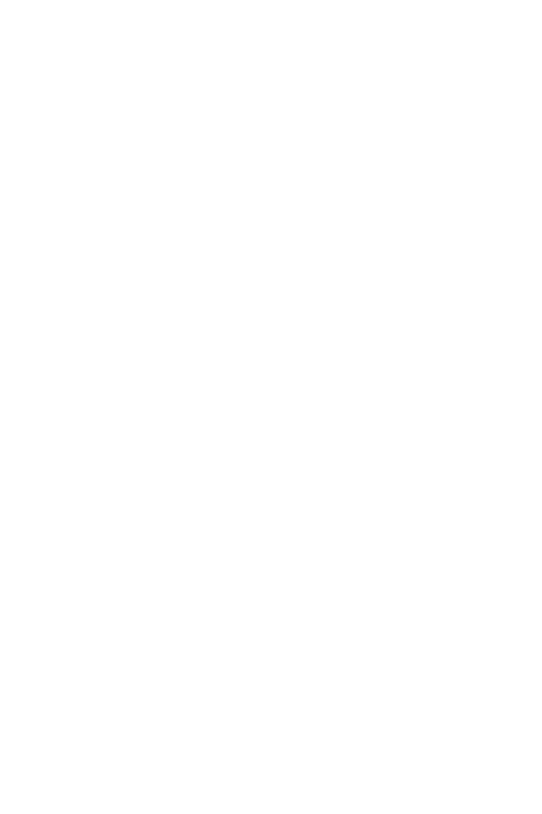

# 🎨 تحسين محتوى صورة باستخدام ChatGPT

## 🏆 ChatGPT Image Enhancement Task

**تطبيق عملي على Poster لفعالية رياضية — يوم التنس**

> الهدف: استخدام ChatGPT بطريقة منظمة لتحليل صورة، تحديد الدور المناسب، استخراج المحتوى، تحسين الصياغة، اقتراح تطوير بصري، ثم إنتاج نتيجة تصميمية محسّنة.

---

## 🎯 المطلوب في التاسك

- تحليل محتوى الصورة.
- استخراج النص الموجود بها كما هو.
- اكتشاف الأخطاء ونقاط الضعف.
- تحسين النص لغويًا وتسويقيًا.
- اقتراح عنوان وترتيب أفضل للمعلومات.
- اقتراح تحسينات تصميمية عملية.
- إنتاج نسخة محسّنة من الـPoster.
- توثيق العملية كاملة: **Input → Prompt → Analysis → Improvement → Result**.

---

## 👤 الدور المحدد لـChatGPT

تم تحديد شخصية ChatGPT قبل تنفيذ المهمة ليعمل باعتباره:

> **خبيرًا في تصميم المحتوى الإعلاني والتسويق البصري، ومتخصصًا في تحسين الـPosters والمنشورات الرقمية باللغة العربية.**

وهذا يجعل الطلب أكثر دقة من مجرد إعطاء أمر عام مثل «حسّن الصورة».

---

## 🧠 الـPrompt المستخدم — النسخة الاحترافية

```text
أنت خبير في تصميم المحتوى الإعلاني والتسويق البصري، ومتخصص في تحسين الـPosters والمنشورات الرقمية باللغة العربية.

سأرفق لك صورة Poster إعلاني لفعالية رياضية.

مهمتك هي:

1. تحليل الصورة بالكامل من حيث المحتوى، النصوص، التسلسل البصري، وضوح المعلومات، والعناصر التصميمية.
2. استخراج جميع النصوص الموجودة في الصورة كما هي، دون تعديل.
3. مراجعة النصوص واكتشاف الأخطاء اللغوية أو الأسلوبية إن وجدت.
4. إعادة صياغة النص ليصبح أكثر احترافية ووضوحًا وجاذبية للجمهور المستهدف، مع الحفاظ على فكرة الإعلان وجميع المعلومات الأساسية الموجودة في الصورة.
5. اقتراح عنوان رئيسي أكثر جذبًا إذا كان ذلك مناسبًا.
6. تحسين ترتيب المعلومات بحيث يستطيع القارئ فهم الإعلان بسرعة.
7. اقتراح تحسينات على التصميم، مثل ترتيب العناصر، أحجام العناوين، الألوان، المساحات، الصور، والأيقونات.
8. الحفاظ على الهوية البصرية الأساسية للإعلان وعدم تغيير فكرته بشكل جذري.

أريد أن تكون النتيجة منظمة بالشكل التالي:

أولًا: تحليل الصورة.
ثانيًا: النص الأصلي المستخرج من الصورة.
ثالثًا: الأخطاء أو نقاط الضعف الموجودة.
رابعًا: النص المحسّن المقترح.
خامسًا: التحسينات التصميمية المقترحة.
سادسًا: وصف مختصر لشكل الـPoster النهائي المقترح.

استخدم لغة عربية واضحة واحترافية، واجعل الاقتراحات عملية وقابلة للتنفيذ.
```

---

## 🔄 Before / After

### ① الصورة الأصلية



### ② النتيجة الجديدة



---

## 📝 النص الأصلي

- مجموعة المرونة — الاتحاد من أجل المساواة.
- أنت مدعو إلى فعالية رياضية: يوم التنس.
- انضم إلينا في بطولة التنس لجمع الأموال لمجموعة المرونة لتقديم المساعدات بكل حب.
- الميعاد: 13 يونيو إلى 13 يوليو، من 9 ص إلى 1 م، كل أسبوع لمدة 4 أسابيع.
- المكان: ملعب تنس بمجموعة المرونة.
- نرحب بلاعبي التنس من جميع المستويات والقدرات للانضمام إلى المرح.
- للتسجيل: reallygreatsite.com

---

## 🔍 نقاط الضعف التي تم اكتشافها

- بعض الصياغات يمكن جعلها أكثر رسمية وسلاسة.
- «الميعاد» يمكن استبدالها بـ«الموعد».
- جملة جمع الأموال طويلة نسبيًا وتحتاج إلى تبسيط.
- رابط التسجيل يحتاج إلى إبراز أقوى.
- بعض المعلومات المهمة تحتاج إلى تسلسل بصري أوضح.
- النصوص الصغيرة يمكن تحسين قابليتها للقراءة على الهاتف.

---

## ✨ النص المحسّن

### أنت مدعو إلى
# فعالية رياضية — يوم التنس

انضم إلينا في بطولة التنس لمجموعة المرونة **للمشاركة ودعم تقديم المساعدات للمحتاجين.**

**الموعد**  
13 يونيو إلى 13 يوليو — من 9 ص إلى 1 م — كل أسبوع لمدة 4 أسابيع.

**المكان**  
ملعب تنس مجموعة المرونة.

**نرحب بجميع لاعبي التنس من جميع المستويات والقدرات للانضمام والاستمتاع بيوم مليء بالرياضة والمرح!**

**التسجيل:** reallygreatsite.com

---

## 🎨 التحسينات التصميمية

1. جعل «يوم التنس» هو العنصر البصري الأكثر جذبًا.
2. تقسيم الموعد والمكان في بطاقات واضحة.
3. استخدام أيقونات للموعد والمكان والتسجيل.
4. الحفاظ على البنفسجي والبرتقالي والأبيض كهوية أساسية.
5. زيادة المساحات البيضاء حول المعلومات المهمة.
6. تقليل منافسة النصوص الثانوية مع العنوان الرئيسي.
7. إبراز Call To Action للتسجيل بشكل واضح.
8. جعل التصميم مناسبًا للعرض على الهاتف ووسائل التواصل الاجتماعي.
9. إضافة صورة/عنصر بصري مرتبط بالتنس لدعم الرسالة.

---

## 🚀 ما الذي تغيّر عن الـPrompt القديم؟

النسخة الجديدة لا تطلب «تحسين الصورة» بشكل عام فقط، بل تحدد:

**👤 Role → 🎯 Task → 📏 Constraints → 📋 Output Format**

وهذا يجعل عملية ChatGPT أكثر قابلية للتوثيق والتقييم، ويُظهر للمدرب استخدامًا منهجيًا للأداة.

---

## 📂 هيكل المشروع

```text
chatgpt-image-enhancement-task/
├── README.md
├── index.html
└── images/
    ├── original-poster.png
    ├── enhanced-poster.png
    ├── enhanced-poster.svg
    ├── original-poster.svg
    └── enhanced-poster-v2.svg
```

> ملفات SVG القديمة موجودة كإصدارات سابقة، لكن صفحة العرض الحالية تعتمد على **النتيجة الجديدة V2**.

---

## 🤖 الخلاصة

تم تطوير التاسك على مرحلتين: أولًا Prompt عام للتحسين، ثم Prompt احترافي يحدد شخصية ChatGPT ومهامه والقيود وشكل المخرجات. بعد ذلك تم إنتاج **نتيجة تصميمية جديدة** مبنية على التحليل المحسّن.

**النتيجة النهائية: توثيق كامل للعملية من الصورة الأصلية إلى الـPrompt الاحترافي ثم التحليل والتحسين والنتيجة الجديدة.**
